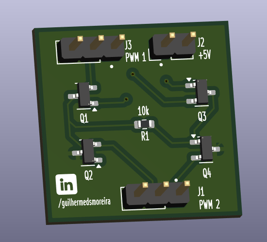

# ⚡Single-Phase Inverter – PCB Design (Part 2)

This repository contains the second part of the project: the PCB design of a single-phase inverter.  
The schematic and simulation were previously developed in [Part 1](https://github.com/guilhermedsmoreira/Single-Phase-Inverter-with-PWM-Control-Part-1).

---

## 🔧 Tools Used

- **LTspice** – Circuit simulation
- **KiCad 9.0** – Schematic capture and PCB layout

---

## 🛠️ Step-by-Step Overview

### 1. Schematic Design
- The schematic was recreated in KiCad using the same topology from LTspice.
- NMOS, resistors, connectors, and power symbols were included.
- Nets were labeled to improve readability and debugging.

### 2. Footprint Assignment
- Standard SMD footprints were used (e.g., SOT-23 for MOSFETs).
- All components were matched using KiCad’s default libraries.

### 3. PCB Layout
- Traces were sized based on the expected low current (~0.5mA).
- Ground planes were added to both top and bottom layers.
- Silkscreen includes component labels, revision data, and LinkedIn handle for authorship.

### 4. DRC and ERC Checks
- No Design Rule Check (DRC) or Electrical Rule Check (ERC) errors found.
- Ratsnest was cleaned for optimal routing and clarity.

### 5. Gerber Generation
- Gerber and drill files were exported and are ready for manufacturing.
- All files are located in the `Gerbers.zip` archive.

  
